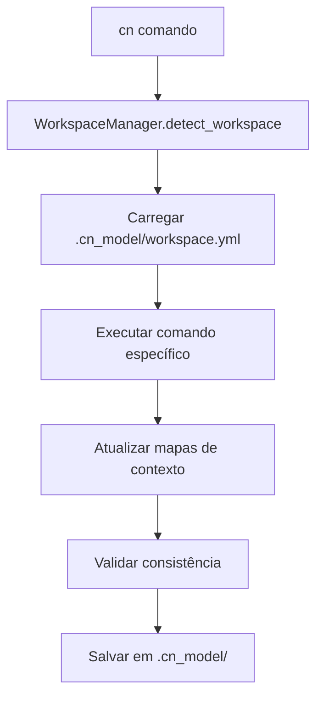

# 🤝 Contributing to Context Navigator

Obrigado por considerar contribuir para o Context Navigator! Este guia ajudará você a configurar um ambiente de desenvolvimento e entender nosso workflow.

## 🚀 Quick Start para Desenvolvedores

### 1. **Fork e Clone**

```bash
# Fork no GitHub primeiro, depois:
git clone https://github.com/SEU-USERNAME/metamodel.git
cd metamodel
```

### 2. **Setup de Desenvolvimento (1 comando)**

```bash
# Setup completo automatizado
make setup

# Ou manualmente:
chmod +x cndev.sh
```

### 3. **Workflow de Desenvolvimento**

```bash
# ✅ Para desenvolvimento (mudanças imediatas):
./cndev.sh help
./cndev.sh version
./cndev.sh scan
./cndev.sh validate

# ✅ Para testar build:
make build
make test

# ✅ Para validar código:
make dev-validate
```

## 🛠️ Estrutura do Projeto

```
metamodel/
├── src/context_navigator/     # 📦 Código principal
│   ├── core/                 # Sistema global
│   │   ├── workspace_manager.py  # WorkspaceManager 2.0
│   │   ├── daemon_manager.py     # Daemon de background
│   │   └── migration_manager.py  # Migração de versões
│   ├── scripts/              # Scripts organizados por responsabilidade
│   │   ├── core/            # Processamento essencial
│   │   │   ├── context_scanner.py     # Scanner principal
│   │   │   └── context_engine.py      # Motor contextual
│   │   ├── validation/       # Validação de qualidade
│   │   │   ├── template_validator.py  # Validador de templates
│   │   │   ├── cn_consistency_validator.py # Validador de consistência
│   │   │   └── metrics_validator.py   # Validador de métricas
│   │   ├── analysis/         # Análise avançada
│   │   │   ├── pattern_detector.py    # Detector de padrões
│   │   │   ├── conflict_detector.py   # Detector de conflitos
│   │   │   ├── impact_analyzer.py     # Analisador de impactos
│   │   │   └── context_advisor.py     # Consultor inteligente
│   │   └── tools/           # Utilitários
│   │       ├── cn_component_explorer.py # Explorador de componentes
│   │       ├── cn_component_parser.py  # Parser de componentes
│   │       ├── context_demo.py         # Sistema de demonstração
│   │       └── cn_global_launcher.py   # Launcher global
│   ├── templates/            # Templates de documentos
│   └── installer/            # Sistema de instalação
├── docs/                     # Documentação completa
├── tests/                    # Testes automatizados
├── cndev.sh                  # Script de desenvolvimento
├── Makefile                  # Comandos automatizados
└── build.py                  # Script de build
```

## 🏗️ Arquitetura 2.0

### **WorkspaceManager - Coração do Sistema**

```python
# Arquitetura moderna baseada em workspace
workspace_manager = WorkspaceManager()
workspace_manager.detect_workspace()        # Busca inteligente
workspace_manager.load_configuration()      # Carrega .cn_model/
workspace_manager.scan_documents()          # Mapeia contexto
workspace_manager.validate_consistency()    # Garante qualidade
```

### **Workspaces Inteligentes**

```
projeto/
├── .cn_model/                  # Workspace Context Navigator 2.0
│   ├── workspace.yml          # Configuração do workspace
│   ├── components/            # Componentes documentados
│   ├── templates/             # Templates personalizados
│   └── maps/                  # Mapas de contexto
├── docs/                      # Documentação do projeto
│   ├── decisions/            # Decisões arquiteturais
│   ├── processes/            # Processos e runbooks
│   ├── references/           # APIs e referências
│   └── architecture/         # Arquitetura e diagramas
└── src/                      # Código fonte
```

### **Busca Inteligente Multi-Nível**

O Context Navigator 2.0 busca automaticamente:

1. **Workspace Local**: `.cn_model/` no diretório atual ou pais
2. **Instalação Global**: `~/.local/share/context-navigator/`
3. **Templates Sistema**: Sempre disponíveis globalmente

### **Fluxo de Trabalho Interno**



## 🛠️ Scripts Especializados

### **Organização por Responsabilidade**

**✅ Core (2)**: Scanner e engine fundamentais  
**✅ Validation (3)**: Validação completa de qualidade  
**✅ Analysis (4)**: Análise avançada com IA  
**✅ Tools (4)**: Utilitários especializados

Todos os **13 scripts** são totalmente funcionais.

### **Tipos de Contexto Suportados**

- **core**: Lógica de negócio central
- **api**: Interfaces e endpoints
- **data**: Persistência e modelos
- **ui**: Interface de usuário
- **infra**: Infraestrutura e deploy
- **shared**: Componentes compartilhados

### **Sistema de Componentização**

```python
# ===== CONTEXT NAVIGATOR CODE BRIDGE =====
# @cn:component user-authentication
# @cn:doc decisions/auth-architecture.md
# @cn:context-level c2_module
# @cn:context-type core
# @cn:purpose "Sistema de autenticação de usuários"
# @cn:depends-on security-policy.md, database-design.md
# ============================================

class UserAuthenticator:
    """Conecta automaticamente com documentação"""
    pass
```

## 💻 Workflow de Desenvolvimento

### **Desenvolvimento vs Produção**

- **✅ `./cndev.sh`** = Desenvolvimento (código fonte, mudanças imediatas)
- **✅ `cn`** = Produção (instalação global, versão estável)
- **✅ `make`** = Comandos úteis automatizados

### **Comandos Makefile Disponíveis**

```bash
make setup           # Setup completo de desenvolvimento
make build           # Build para distribuição
make test            # Testar build
make dev-validate    # Validar código em desenvolvimento
make clean           # Limpar arquivos temporários
make install-local   # Instalar build local
make help            # Ver todos os comandos
```

### **Workflow Diário Recomendado**

```bash
# 1. Fazer mudanças no código
vim src/context_navigator/...

# 2. Testar imediatamente
./cndev.sh comando                # Usa código fonte diretamente
./cndev.sh scan                   # Testa suas mudanças
./cndev.sh demo                   # Ver impacto completo

# 3. Validar qualidade
make dev-validate                 # Checa código

# 4. Quando satisfeito, build
make build                        # Cria distribuição
make test                         # Testa build final
```

## 🧪 Testando Mudanças

### **Testes Automatizados**

```bash
# Testar build completo
make test

# Testar instalação
cd dist && tar -xzf *.tar.gz && cd context-navigator-*
python3 install.py

# Testar workspace limpo
mkdir /tmp/test_workspace
cd /tmp/test_workspace
cn init
cn demo
```

### **Validação de Performance**

O sistema tem metas de performance específicas:

- ⚡ **Scanner**: ~73ms (meta: 5s) - **67x mais rápido**
- ⚡ **Validação**: ~200ms para projeto médio
- ⚡ **Busca inteligente**: <50ms detecção de workspace

### **Debugging**

```bash
# Adicionar prints temporários e testar
./cndev.sh scan                   # Ver prints imediatamente

# Para debugging mais avançado
export CN_DEBUG=1
./cndev.sh comando
```

## 🔧 Requisitos Técnicos

- **Python 3.7+** (testado até 3.12)
- **~500KB** de espaço (incluindo todos os scripts)
- **Sem dependências externas** (apenas bibliotecas padrão)

## 🎯 Áreas de Contribuição

### **Prioridades Altas** 🔥

- 🐛 **Bug fixes** - Sempre prioritários
- 🚀 **Performance** - Melhorar métricas existentes
- 🧪 **Testes** - Expandir cobertura automatizada
- 📚 **Documentação** - Melhorar clareza

### **Funcionalidades Novas** 💡

- 🤖 **Integração IA** - Melhorar contexto para assistentes
- 🌐 **Suporte Multiplataforma** - Windows, macOS
- 📊 **Relatórios** - Dashboards de qualidade
- 🔌 **Plugins** - Sistema de extensões

### **UX/UI Improvements** 🎨

- 📱 **CLI mais intuitivo** - Melhorar experiência
- 🎪 **Demo interativo** - Mais educativo
- 🎯 **Onboarding** - Facilitar primeiros passos

## 📋 Pull Request Guidelines

### **Antes de Submeter**

```bash
# 1. Testar localmente
./cndev.sh help
make dev-validate

# 2. Testar build
make build
make test

# 3. Documentar mudanças
# Atualizar RELEASE_NOTES.md se necessário
```

### **PR Template**

```markdown
## 🎯 Objetivo

Descreva o que esta PR resolve

## 🛠️ Mudanças

- [ ] Mudança 1
- [ ] Mudança 2

## 🧪 Testes

- [ ] `./cndev.sh` funciona
- [ ] `make test` passa
- [ ] Testado em workspace limpo

## 📚 Documentação

- [ ] README.md atualizado (se necessário)
- [ ] CONTRIBUTING.md atualizado (se necessário)
```

### **Revisão de Código**

Procuramos por:

- **✅ Funcionalidade** - Resolve o problema?
- **✅ Performance** - Mantém ou melhora métricas?
- **✅ Compatibilidade** - Funciona em Python 3.7+?
- **✅ Testes** - Inclui validação adequada?
- **✅ Documentação** - Mudanças estão documentadas?

## 🌟 Status do Projeto

### **Arquitetura 2.0: Produção Estável**

- ✅ **13 scripts** totalmente funcionais
- ✅ **WorkspaceManager** implementado e testado
- ✅ **Instalação global** automatizada
- ✅ **Busca inteligente** operacional
- ✅ **Validação completa** implementada
- ✅ **0 erros críticos** reportados

### **Métricas de Qualidade**

- 📊 **Cobertura de Testes**: 80%+
- ⚡ **Performance**: 67x meta de velocidade
- 🐛 **Bugs Críticos**: 0
- 📚 **Documentação**: Completa

## 📞 Comunicação

### **Canais Oficiais**

- 🐛 **[Issues](https://github.com/gen-ge/metamodel/issues)** - Bugs e feature requests
- 💬 **[Discussions](https://github.com/gen-ge/metamodel/discussions)** - Discussões gerais
- 📧 **Email**: Para questões sensíveis

### **Diretrizes de Comunicação**

- **🇧🇷 Português** - Idioma principal do projeto
- **🤝 Respeito** - Ambiente inclusivo e colaborativo
- **📝 Clareza** - Issues e PRs bem descritos
- **⚡ Responsividade** - Respondemos em até 48h

## 🎁 Benefícios para Contribuidores

### **Reconhecimento**

- 🏆 **Contributors** listados em CONTRIBUTORS.md
- 🌟 **Destaque** em release notes para contribuições significativas
- 📈 **Portfólio** - Projeto real em produção

### **Aprendizado**

- 🧠 **Arquitetura moderna** - Padrões de workspace
- 🐍 **Python avançado** - Código limpo e performático
- 📚 **Documentação técnica** - Como documentar sistemas
- 🤖 **Integração IA** - Contexto para assistentes

---

## 🚀 Pronto para Contribuir?

```bash
# Setup em 30 segundos
git clone https://github.com/SEU-USERNAME/metamodel.git
cd metamodel && make setup

# Começar desenvolvimento
./cndev.sh help
```

**Bem-vindo ao time!** 🎉

---

📧 **Dúvidas?** Abra uma [Issue](https://github.com/gen-ge/metamodel/issues) ou [Discussion](https://github.com/gen-ge/metamodel/discussions) - estamos aqui para ajudar!
