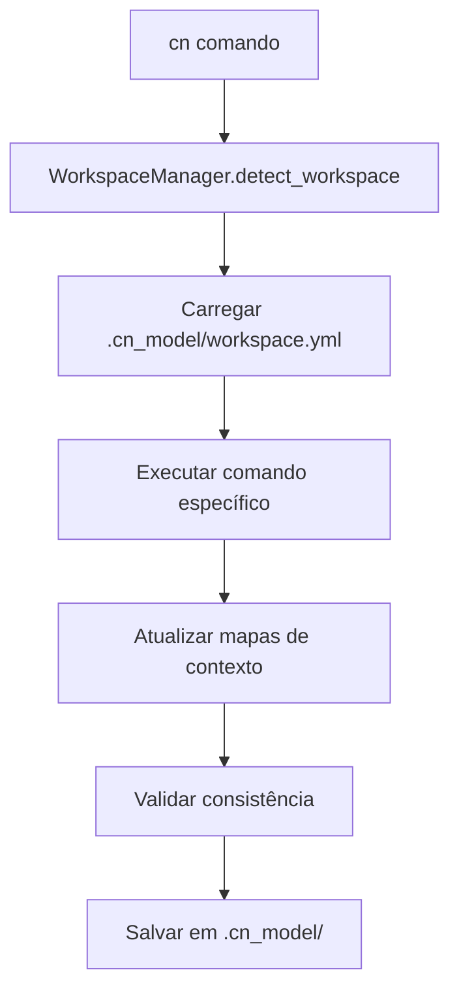

# 🧭 Context Navigator 2.0

> Sistema inteligente de documentação contextual com arquitetura global e componentização avançada

[](https://python.org)
[](LICENSE)
[]()
[]()

## 🎯 O que é o Context Navigator 2.0?

Sistema revolucionário de **documentação contextual** que:

- **🌐 Funciona globalmente** - Use `cn` de qualquer diretório
- **🔍 Busca inteligente** - Encontra workspaces automaticamente
- **🧩 Componentização** - Conecta documentação com código
- **🤖 IA contextualizada** - Sempre sabe o estado do projeto
- **📋 Templates inteligentes** - Estruturas padronizadas para tudo
- **⚡ Validação automática** - Detecta problemas em tempo real

## 🚀 Instalação Única (Recomendada)

### Instalação Global Automatizada

```bash
# Instalar globalmente (funciona de qualquer lugar)
curl -L https://github.com/gen-ge/metamodel/releases/latest/download/install-context-navigator-latest.sh | bash

# Configurar PATH (adicione ao ~/.bashrc)
export PATH="$HOME/.local/bin:$PATH"
source ~/.bashrc

# Testar instalação
cn help
```

### Alternativa: Instalação Local

```bash
# Clonar repositório
git clone https://github.com/gen-ge/metamodel.git
cd metamodel

# Instalar localmente
python3 src/context_navigator/installer/install.py

# Usar com busca inteligente
python3 -m context_navigator.cn_cli_legacy scan
```

## ⚡ Primeiros Passos

```bash
# 1. Inicializar workspace (em qualquer projeto)
cd seu-projeto/
cn init

# 2. Criar primeiro documento
cn new decision "arquitetura-do-sistema"

# 3. Escanear e conectar documentos
cn scan

# 4. Ver demonstração completa
cn demo

# 5. Validar qualidade
cn validate
```

## 🏗️ Arquitetura 2.0

### **Workspaces Inteligentes**

```
projeto/
├── .cn_model/                  # Workspace Context Navigator 2.0
│   ├── workspace.yml          # Configuração do workspace
│   ├── components/            # Componentes documentados
│   ├── templates/             # Templates personalizados
│   └── maps/                  # Mapas de contexto
├── docs/                      # Documentação do projeto
│   ├── decisions/            # Decisões arquiteturais
│   ├── processes/            # Processos e runbooks
│   ├── references/           # APIs e referências
│   └── architecture/         # Arquitetura e diagramas
└── src/                      # Código fonte
```

### **Busca Inteligente Multi-Nível**

O Context Navigator 2.0 busca automaticamente:

1. **Workspace Local**: `.cn_model/` no diretório atual ou pais
2. **Instalação Global**: `~/.local/share/context-navigator/`
3. **Templates Sistema**: Sempre disponíveis globalmente

```bash
# Funciona de qualquer lugar!
cd projeto/                     # cn scan ✅
cd projeto/src/                 # cn scan ✅ (busca em ../)
cd projeto/src/components/      # cn scan ✅ (busca em ../../)
cd /qualquer/outro/lugar/       # cn scan ✅ (usa instalação global)
```

## 📋 Comandos Avançados

### **Criação de Documentos**

```bash
# Templates principais
cn new decision "nome"          # Decisões técnicas (ADRs)
cn new process "nome"           # Processos e runbooks
cn new reference "nome"         # APIs e documentação técnica
cn new architecture "nome"      # Arquitetura e diagramas
cn new analysis "nome"          # Análises e investigações
cn new planning "nome"          # Planejamento e roadmaps

# Com contexto específico
cn new decision "auth-choice" --context-type core --level c2_module
```

### **Gerenciamento de Workspace**

```bash
# Workspace
cn init                         # Inicializar workspace atual
cn status                       # Status do workspace
cn scan                         # Escanear e mapear documentos
cn demo                         # Demonstração interativa

# Validação e qualidade
cn validate                     # Validar todos os documentos
cn validate metrics             # Validar métricas específicas
cn check                        # Verificar consistência geral
```

### **Ferramentas Avançadas**

```bash
# Exploração
cn explore                      # Explorar componentes
cn parse                        # Parser de componentes
cn conflicts                    # Detectar conflitos

# Análise e métricas
cn analyze documento.md         # Analisar documento específico
cn metrics                      # Métricas de qualidade
cn advisor                      # Sugestões inteligentes
```

## 🧩 Sistema de Componentização

### **Conectando Documentação ↔ Código**

```python
# ===== CONTEXT NAVIGATOR CODE BRIDGE =====
# @cn:component user-authentication
# @cn:doc decisions/auth-architecture.md
# @cn:context-level c2_module
# @cn:context-type core
# @cn:purpose "Sistema de autenticação de usuários"
# @cn:depends-on security-policy.md, database-design.md
# ============================================

class UserAuthenticator:
    """Autenticador de usuários integrado ao Context Navigator"""
    pass
```

### **Níveis de Contexto**

- **c1_root**: Decisões de sistema (arquitetura geral, tecnologias principais)
- **c2_module**: Decisões de módulo (funcionalidades específicas, APIs internas)
- **c3_component**: Decisões de componente (implementação detalhada, configurações)

### **Tipos de Contexto**

- **core**: Lógica de negócio central
- **api**: Interfaces e endpoints
- **data**: Persistência e modelos
- **ui**: Interface de usuário
- **infra**: Infraestrutura e deploy
- **shared**: Componentes compartilhados

## 🎯 Tipos de Documento

| Tipo                | Uso                      | Template      | Exemplo                        |
| ------------------- | ------------------------ | ------------- | ------------------------------ |
| **📋 Decision**     | ADRs, escolhas técnicas  | 40% dos casos | "Escolha do banco de dados"    |
| **⚙️ Process**      | Runbooks, tutoriais      | 20% dos casos | "Deploy em produção"           |
| **📖 Reference**    | APIs, documentação       | 15% dos casos | "API de autenticação"          |
| **🏗️ Architecture** | Diagramas, componentes   | 10% dos casos | "Arquitetura de microserviços" |
| **🔍 Analysis**     | Debugging, investigações | 10% dos casos | "Análise de performance"       |
| **📅 Planning**     | Roadmaps, sprints        | 5% dos casos  | "Roadmap Q1 2024"              |

## 🛠️ Scripts Especializados

### **Organização por Responsabilidade**

```
src/context_navigator/scripts/
├── core/                       # Processamento essencial
│   ├── context_scanner.py     # Scanner principal
│   └── context_engine.py      # Motor contextual
├── validation/                 # Validação de qualidade
│   ├── template_validator.py  # Validador de templates
│   ├── cn_consistency_validator.py # Validador de consistência
│   └── metrics_validator.py   # Validador de métricas
├── analysis/                   # Análise avançada
│   ├── pattern_detector.py    # Detector de padrões
│   ├── conflict_detector.py   # Detector de conflitos
│   ├── impact_analyzer.py     # Analisador de impactos
│   └── context_advisor.py     # Consultor inteligente
└── tools/                      # Utilitários
    ├── cn_component_explorer.py # Explorador de componentes
    ├── cn_component_parser.py  # Parser de componentes
    ├── context_demo.py         # Sistema de demonstração
    └── cn_global_launcher.py   # Launcher global
```

### **Todos os 13 Scripts Funcionais**

✅ **Core (2)**: Scanner e engine fundamentais  
✅ **Validation (3)**: Validação completa de qualidade  
✅ **Analysis (4)**: Análise avançada com IA  
✅ **Tools (4)**: Utilitários especializados

## 🔧 Como Funciona Internamente

### **WorkspaceManager 2.0**

```python
# Arquitetura moderna baseada em workspace
workspace_manager = WorkspaceManager()
workspace_manager.detect_workspace()        # Busca inteligente
workspace_manager.load_configuration()      # Carrega .cn_model/
workspace_manager.scan_documents()          # Mapeia contexto
workspace_manager.validate_consistency()    # Garante qualidade
```

### **Fluxo de Trabalho**



## 🎁 Benefícios da Versão 2.0

### **Para Desenvolvedores**

- ✅ **Comando global** `cn` disponível em qualquer diretório
- ✅ **Busca inteligente** automática de workspaces
- ✅ **Componentização** conecta docs ↔ código
- ✅ **Templates padronizados** para todos os tipos
- ✅ **Validação automática** em tempo real

### **Para Arquitetos**

- ✅ **Visão componentizada** do sistema completo
- ✅ **Rastreabilidade** decisão → implementação
- ✅ **Impactos mapeados** automaticamente
- ✅ **Evolução documentada** com histórico

### **Para IAs**

- ✅ **Contexto completo** via workspace.yml
- ✅ **Relacionamentos explícitos** entre documentos
- ✅ **Templates estruturados** padronizados
- ✅ **Validação automática** de qualidade

## 📚 Documentação Completa

### **Guias Essenciais**

- **⚡ [Quick Start](QUICK_START.md)** - 15 minutos para dominar
- **🌐 [Instalação Global](docs/INSTALACAO_GLOBAL.md)** - Instalação e configuração
- **📖 [Manual Humano](docs/MANUAL_HUMANO.md)** - Guia completo do usuário
- **🤖 [Manual da IA](docs/MANUAL_IA.md)** - Protocolo para sistemas de IA
- **🎯 [Convenções](docs/CONVENTIONS.md)** - Regras e padrões

### **Arquitetura do Sistema**

- **🏗️ [Componentes Core](docs/c3-components/)** - Scanner, engine, validação
- **🔧 [Módulos](docs/c2-modules/)** - CLI, interfaces, processamento
- **🌐 [Sistema Global](docs/c3-components-global/)** - WorkspaceManager, instalação

### **Exemplos Práticos**

- **💡 [Exemplos](examples/)** - Casos de uso reais
- **🎪 [Demonstrações](src/context_navigator/scripts/tools/context_demo.py)** - Demo interativo

## 🔧 Requisitos

- **Python 3.7+** (testado até 3.12)
- **~500KB** de espaço (incluindo todos os scripts)
- **Sem dependências externas** (apenas bibliotecas padrão)

## 🏆 Status do Projeto

### **Arquitetura 2.0: Produção**

- ✅ **13 scripts** totalmente funcionais
- ✅ **WorkspaceManager** implementado e testado
- ✅ **Instalação global** automatizada
- ✅ **Busca inteligente** operacional
- ✅ **Validação completa** implementada
- ✅ **0 erros críticos** reportados

### **Performance**

- ⚡ **Scanner**: ~73ms (meta: 5s) - **67x mais rápido**
- ⚡ **Validação**: ~200ms para projeto médio
- ⚡ **Busca inteligente**: <50ms detecção de workspace

## 🤝 Contribuindo

Contribuições são muito bem-vindas! O projeto está maduro e estável.

```bash
# Clonar e instalar desenvolvimento
git clone https://github.com/gen-ge/metamodel.git
cd metamodel
python3 src/context_navigator/installer/install.py

# Executar testes
cn demo  # Demonstração completa
cn validate  # Validação de qualidade
```

### **Áreas de Contribuição**

- 🐛 **Bug fixes** - Sempre prioritários
- 🚀 **Novas funcionalidades** - Discutir em issues primeiro
- 📚 **Documentação** - Sempre bem-vinda
- 🧪 **Testes** - Expandir cobertura
- 🎨 **UX/UI** - Melhorar experiência

## 📄 Licença

[MIT License](LICENSE) - Use livremente em qualquer projeto!

---

## 🚀 Transforme sua Documentação!

**Context Navigator 2.0** é a evolução definitiva para documentação contextual inteligente.

### **Começar Agora**

```bash
# 1 comando para começar
curl -L https://github.com/gen-ge/metamodel/releases/latest/download/install-context-navigator-latest.sh | bash

# Usar imediatamente
cn init
cn demo
```

---

📧 **Suporte:** [Issues](https://github.com/gen-ge/metamodel/issues) | 💬 **Discussões:** [GitHub Discussions](https://github.com/gen-ge/metamodel/discussions) | 📖 **Documentação:** [Manual Completo](docs/MANUAL_HUMANO.md)
