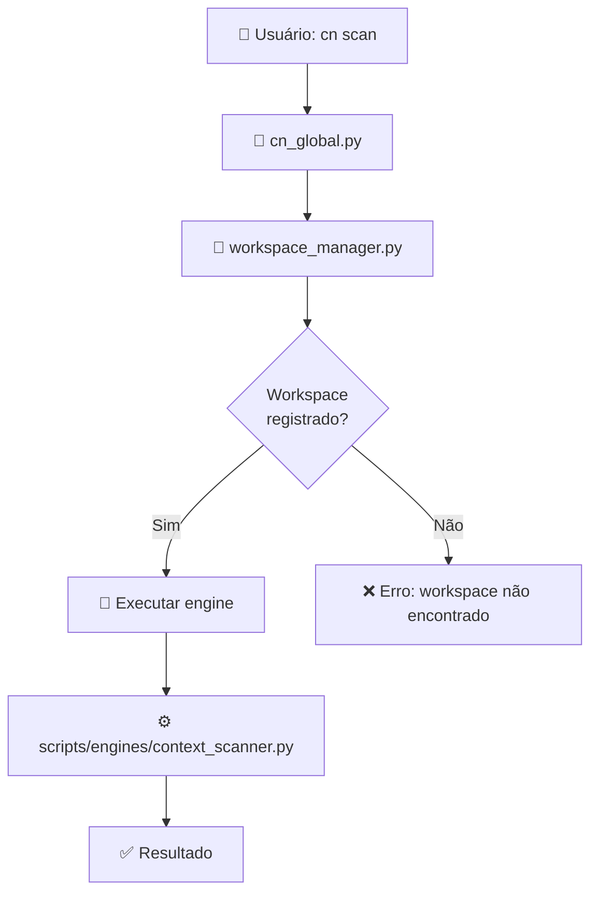

# 🏗️ Context Navigator - Arquitetura Simplificada

## 🎯 **VISÃO GERAL**

Sistema unificado, cristalino e **sem confusões**:

```
📁 src/context_navigator/
├── core/                      # 🧠 CONTROLE (roteamento, gerenciamento)
│   ├── cn_global.py          # ✅ Entry point + roteador de comandos
│   ├── workspace_manager.py  # ✅ Detecção e gerenciamento de workspaces
│   └── daemon_manager.py     # ✅ Gerenciamento de daemon
├── scripts/                   # ⚙️ EXECUÇÃO (engines, ferramentas)
│   ├── engines/              # 🔄 Engines de processamento
│   │   ├── context_scanner.py  # Scanner de código/docs
│   │   └── context_engine.py   # Engine de processamento
│   ├── tools/                # 🛠️ Ferramentas específicas
│   └── validation/           # ✅ Validadores
├── templates/                # 📄 Templates de documentos
├── installer/               # 📦 Sistema de instalação
└── workspaces-registry.yml  # 📋 Registry de workspaces
```

## 🔄 **FLUXO DE COMANDO**



## 🎯 **RESPONSABILIDADES CLARAS**

### 🧠 **core/** - CONTROLE

- **cn_global.py**: Entry point global, detecta workspace, roteia comandos
- **workspace_manager.py**: Detecta workspace pelo registry, gerencia configuração
- **daemon_manager.py**: Gerencia daemon para auto-scan

### ⚙️ **scripts/** - EXECUÇÃO

- **engines/**: Processamento pesado (scan, context engine)
- **tools/**: Ferramentas específicas (explorer, demo)
- **validation/**: Validadores de qualidade

### 📦 **installer/** - INSTALAÇÃO

- **install.py**: Sistema de instalação unificado (local + global)

## 🔧 **SISTEMAS DE BUILD E DESENVOLVIMENTO**

### 🛠️ **Desenvolvimento**

```bash
./cndev.sh scan      # Registry local: src/context_navigator/workspaces-registry.yml
```

### 🏗️ **Build**

```bash
make build           # Interface simples
python3 build.py     # Script simplificado (120 linhas vs 813)
```

### 📦 **Instalação**

```bash
# Global (recomendado)
python3 install.py --global   # ~/.local/share/context-navigator/
cn scan                        # Funciona de qualquer lugar

# Local
python3 install.py             # .context-navigator/ no projeto
```

## 🎯 **ARQUITETURA MENTAL**

### ✅ **ANTES vs DEPOIS**

| **ANTES (Confuso)**        | **DEPOIS (Claro)**                                  |
| -------------------------- | --------------------------------------------------- |
| `core/` vs `scripts/core/` | `core/` (controle) vs `scripts/engines/` (execução) |
| build.py 813 linhas        | build.py 120 linhas                                 |
| Imports com hacks          | Imports limpos                                      |
| 2 sistemas de build        | 1 sistema (Makefile + build.py simples)             |

### 🧠 **PRINCÍPIOS**

1. **SEPARAÇÃO CLARA**: Controle vs Execução
2. **NOMES DESCRITIVOS**: engines/, tools/, validation/
3. **IMPORTS LIMPOS**: Sem hacks de sys.path
4. **SISTEMA ÚNICO**: Um só build, uma só instalação
5. **DETERMINÍSTICO**: Registry como source of truth

## 🎯 **USO COTIDIANO**

```bash
# 1. Desenvolver
./cndev.sh scan
make dev-scan

# 2. Testar
make build
make test

# 3. Distribuir
make release-tag VERSION=2.1.0   # GitHub Actions faz o resto
```

## 🧭 **NAVEGAÇÃO**

- **Iniciante**: Leia [README.md](../README.md)
- **Desenvolvedor**: Leia [CONTRIBUTING.md](../CONTRIBUTING.md)
- **Instalação**: Leia [INSTALACAO_GLOBAL.md](c1-systems/INSTALACAO_GLOBAL.md)
- **Arquitetura**: Este arquivo!
